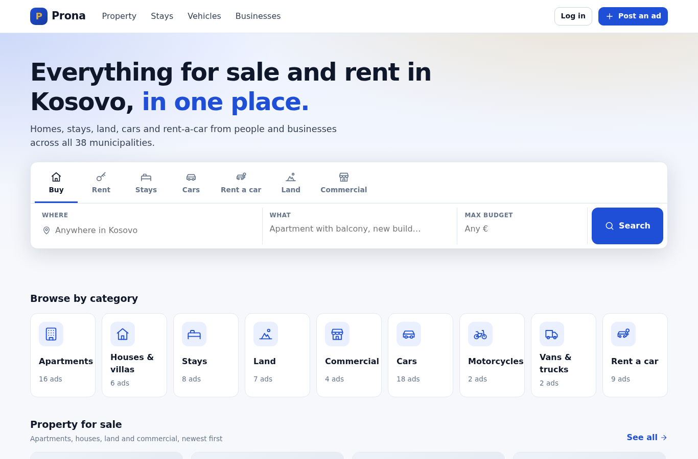
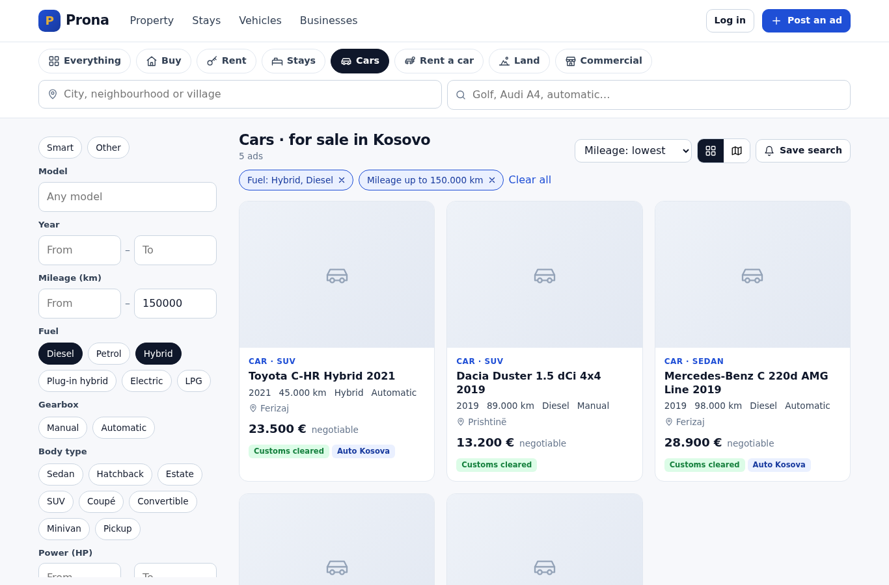
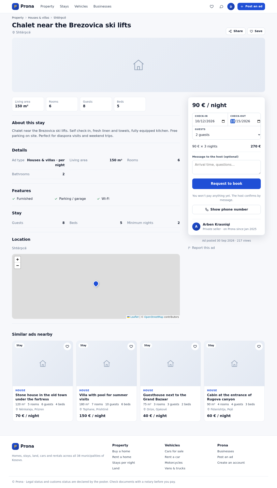
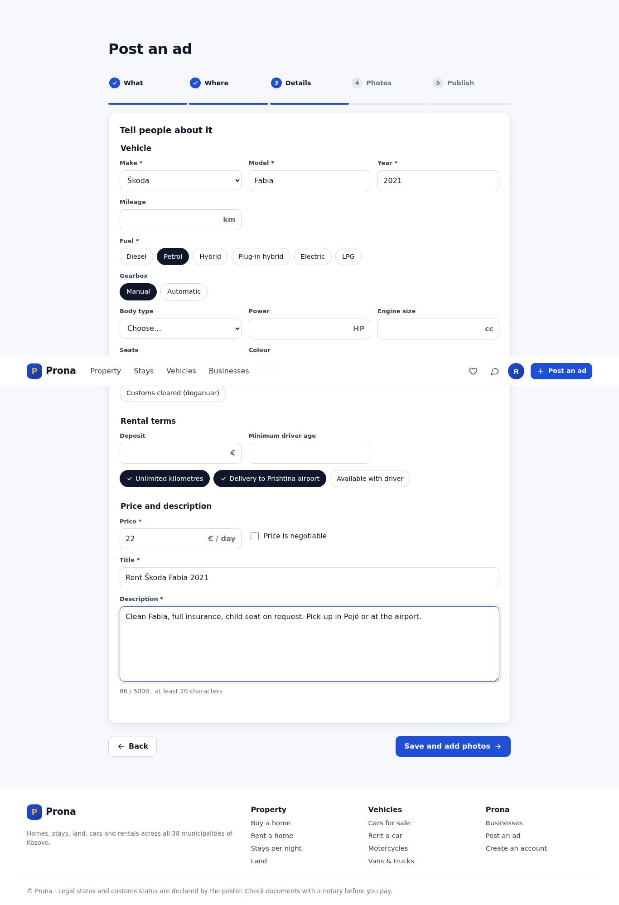
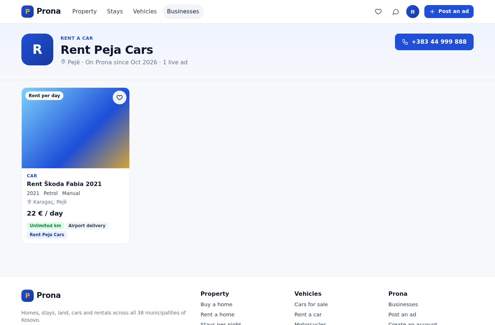
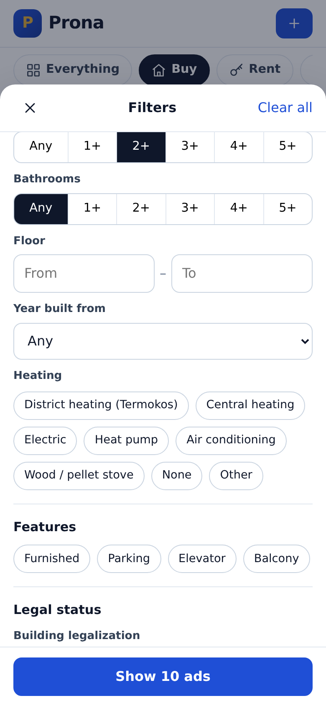
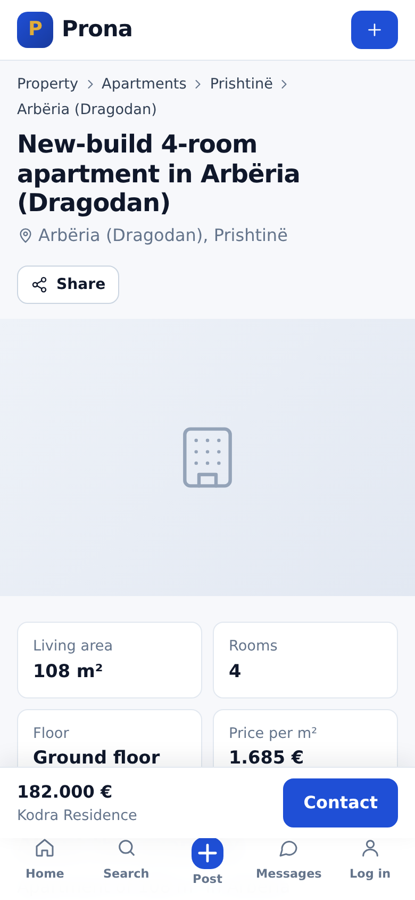

# Prona: buy, rent and book anything in Kosovo

A classifieds marketplace for Kosovo where people and businesses post homes, stays, land, commercial space, cars, motorcycles and vans, for sale, monthly rent, per-night stays or per-day rental.

Every ad shows what matters before you call: the **legal status** of a property (legalization, cadastre certificate *certifikata e pronësisë*, construction permit *leje ndërtimi*) and whether a car is **customs cleared** (*doganuar*). Every municipality, neighbourhood and village is selectable when searching and posting.



## What it does

| Area | Features |
| --- | --- |
| Categories | Apartments, houses & villas, land, commercial, cars, motorcycles, vans & trucks. Each category has its own fields (rooms and floor; plot and land type; make, model, year, mileage, fuel, gearbox; guests and minimum nights; deposit and minimum driver age…) defined once in `Domain/Categories.cs`. The post form, filters, result cards and spec lists are all generated from it, so adding a category is a backend-only change. |
| Deal types | For sale, monthly rent, per night (stays) and per day (rent a car). Each category says which it supports. |
| Locations | All 38 municipalities with their neighbourhoods and villages (about 590 places). The "where" box finds any of them as you type, with or without ë/ç. Ads can add a street and an exact map pin. |
| Search | Shortcuts (buy a home, rent, stays, cars, rent a car, land, commercial), filters built from the category's fields (ranges, "3+" steps, multi-choice chips, yes/no features), removable filter chips, sorting by price, €/m², year or mileage, a map view with price pins and "search this area", radius and bounding-box search on PostGIS. On phones the filters open in a bottom drawer. |
| Ads | Photo gallery with full-screen viewer, key facts, grouped specs, a legal status panel, location map, similar ads nearby, a sticky contact bar on phones. |
| Booking requests | Stays and rent-a-car ads take date requests (and guests for stays). The request arrives in the inbox with the dates and the total worked out, and respects minimum nights and maximum guests. |
| Accounts | One personal account can search, message, book and post. Business accounts (real estate agency, developer, car dealer, rent a car, other) also get a public page with all their ads. |
| Posting | A five-step wizard: what, where, details, photos, publish. It suggests a title from the details, saves the draft before photos, and shows a checklist before sending for review. |
| Trust | Admin review before ads go live, edits to a live ad send it back to review, reporting with takedown, 60-day expiry with reminder and renewal, rate-limited phone reveal. |
| Alerts | Save any search, including field filters, and get emailed new matches. |

## Stack

- **Backend:** ASP.NET Core 10 Web API, EF Core 10, PostgreSQL 16 + PostGIS, category fields in a `jsonb` column (validated per category, GIN-indexed, filtered through two small SQL helper functions) (NetTopologySuite, `geography` column with a GiST index), ImageSharp for photo resizing, MailKit for SMTP, built-in rate limiting.
- **Frontend:** Angular 22 (standalone components, signals, zoneless), Leaflet + OpenStreetMap, responsive down to phone width.
- **Photos:** local disk in development, any S3-compatible store in production (AWS S3, Cloudflare R2, MinIO). Each upload becomes a 1600 px large image and a 480×360 thumbnail, with EXIF (including GPS) stripped.

```
backend/
  src/RealEstate.Api/
    Domain/          entities, categories and their fields, attribute validation, listing lifecycle
    Data/            DbContext, migrations, demo seed
    Features/        one folder per area: Listings, Accounts (incl. businesses), Favorites, SavedSearches, Messaging (incl. booking requests), Moderation, Meta (categories, locations)
    Infrastructure/  JWT, photo storage + processing, email
  tests/RealEstate.Api.Tests/   integration tests against a real PostGIS database
frontend/
  src/app/core/      API client, auth, models, labels, catalog (categories + locations)
  src/app/shared/    listing card, filter panel, location search box, map, icons
  src/app/pages/     home, search, ad page, post wizard, my ads, favorites, alerts, messages, businesses, admin
```

## Running it locally

Prerequisites: .NET 10 SDK, Node 22.22+ or 24, Docker (or a local PostgreSQL 16 with PostGIS).

```bash
docker compose up -d                      # PostGIS on localhost:5433 (5433 so it doesn't clash with a local PostgreSQL)

cd backend/src/RealEstate.Api
dotnet run                                # http://localhost:5102, API docs at /scalar

cd frontend
npm install
npm start                                 # http://localhost:4200, proxies /api and /media to the backend
```

In Development the API migrates the database on startup and seeds demo data:

| Account | Email | Password |
| --- | --- | --- |
| Admin | admin@demo.local | Admin1234! |
| Real estate agency | agency@demo.local | Demo1234! |
| Developer | developer@demo.local | Demo1234! |
| Car dealer | dealer@demo.local | Demo1234! |
| Rent a car | rentacar@demo.local | Demo1234! |
| Host (stays) | host@demo.local | Demo1234! |
| Private seller | owner@demo.local | Demo1234! |
| Buyer | seeker@demo.local | Demo1234! |

## Tests

```bash
cd backend && dotnet test                  # needs PostGIS; set TEST_DATABASE_URL to use another server
cd frontend && npx ng test --watch=false
```

The backend tests spin up the real API in memory against a throwaway database per test class and cover the full ad lifecycle (draft, photos, review, approval, edit re-review, expiry and renewal), validation of category fields and locations, search filters (category, deal, municipality, neighbourhood, price, field filters like rooms, fuel and mileage, radius and bounding box) and sorting, the legal-status filter, booking requests and their rules, business pages, messaging and its access rules, favorites, reporting and takedown, and saved-search email alerts.

## Configuration

| Key | Purpose |
| --- | --- |
| `ConnectionStrings:Default` | PostgreSQL connection string |
| `Jwt:SigningKey` | At least 32 characters; required |
| `Admin:Email`, `Admin:Password` | Admin account created on startup if missing |
| `Storage:Provider` | `Local` or `S3`; with S3 also `S3Bucket`, `S3ServiceUrl`, `S3AccessKey`, `S3SecretKey`, `PublicBaseUrl` |
| `Email:SmtpHost` (+ `SmtpPort`, `SmtpUser`, `SmtpPassword`, `From`) | Without a host, emails are written to the log |
| `Email:AppBaseUrl` | Public URL of the web app, used in email links |
| `Cors:Origins` | Allowed frontend origins |
| `Database:MigrateOnStartup`, `Database:SeedDemoData` | On in Development only |
| `Maintenance:IntervalMinutes` | How often expiry, reminders and saved-search alerts run (default 15) |

## Screenshots

| | |
| --- | --- |
|  |  |
|  |  |
|  |  |

## Next steps

An availability calendar for stays and rentals, paid "featured" ads for businesses, price history, more categories (jobs, services, electronics) and an Albanian / English / German UI for the diaspora.
